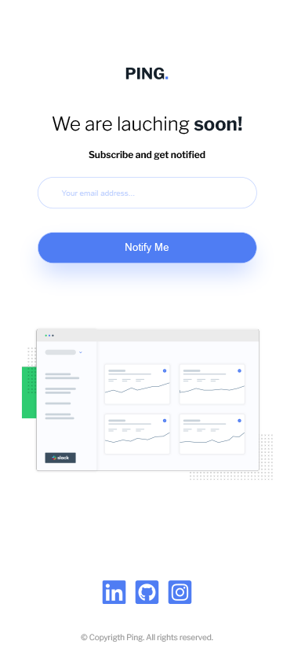
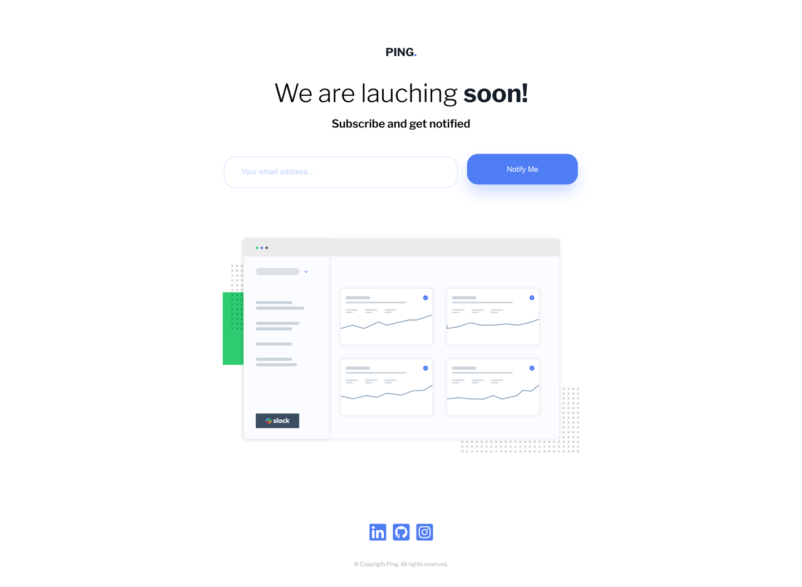

# Frontend Mentor - Ping coming soon page solution

Esta é uma solução para o desafio da [Ping coming soon page challenge on Frontend Mentor]https://www.frontendmentor.io/challenges/ping-single-column-coming-soon-page-5cadd051fec04111f7b848da). Os desafios do Mentor de Frontend ajudam você a melhorar suas habilidades de codificação criando projetos realistas.

## Índice

- [Resumo] (#resumo)
    - [Desafio] (#desafio)
    - [Screenshot] (#screenshot)
    - [Links] (#links)
- [Processo] (#processo)
    - [Construção] (#construção)
    - [Aprendizado] (#aprendizado)
- [Recursos] (#recursos)
- [Autor] (#Autor)

## Resumo

Uma página coming soon com cadastro de e-mail, validação e interatividade de botões.

### Desafio

Os usuários devem ser capazes de:

- Visualizar o layout ideal para o site, dependendo do tamanha da tela do dispositivo;
- Estados de foco para todos os elementos interativos na página;
- Enviar seu endereço de e-mail usando um campo `input`;
- Receber mensagem de erro quando o formulário for enviado se:
  - O campo `input` está vazio. A mensagem para esse erro deve dizer: *"Opa! Parece que você esqueceu de adicionar seu email"*, (*"Whoops! It looks like you forgot to add your email"*)
  - Um endereço de email não está formatado corretamente, ou seja, um endereço de email deve ter uma estrutura `nome@host.tld`. A mensagem para este erro deve dizer: *"Por favor forneça um endereço de email valido"* *"Please provide a valid email address"*

### Screenshot

<span align="center">
    </img>
</span>

------

<span align="center">
    </img>
</span>

### Links

- Solução: [Add solution URL here](https://your-solution-url.com)
- Site=: [Add live site URL here](https://your-live-site-url.com)

## Processo

### Built with

- Marcação semântica HTML5;
- Propriedades personalizadas CSS;
- Variáveis CSS;
- Flexbox;
- Mobile-first workflow;
- JavaScript.

### Aprendizado

Primeiro projeto que utilizo a estrutura HTML BEM.

```HTML
    <main class="container">
        <section class="text">
            <h1 class="text__title">We are lauching <span class="text__title-strong">soon!</span></h1>
            <p class="text__paragraph">Subscribe and get notified</p>
        </section>

        <form class="input">
            <input type="email" name="email" id="email" class="input__email" placeholder="Your email address..." required>
            <div id="email__error" class="input__email-error"></div>
            <button type="button" id="button" class="input__btn">Notify Me</button>
        </form>

        <section class="image">
            
        </section>
    </main>
```

Primeiro projeto que utilizo variáveis CSS.

```css
:root {
    --font: 'Libre Franklin', sans-serif;
    --color-primary: hsl(223, 87%, 63%);
    --color-secondary-blue: hsl(223, 100%, 88%);
    --color-secondary-red: hsl(354, 100%, 66%);
    --color-neutral-gray: hsl(0, 0%, 59%);
    --color-neutral-dark-blue: hsl(209, 33%, 12%);
    --width-logo: 5.4rem;
    --margin-logo: 8.5rem 0 2.2rem;
    --width-page: 100vw;
    --title-size: 2.4rem;
    --title-size-desktop: 4.5rem;
    --paragraph-size: 1.2rem;
    --margin-text: 2.2rem 0;
    --width-email: 24.6rem;
    --height-email: 3.6rem;
    --padding-email: 3rem;
    --width-email-desktop: 38.6rem;
    --height-email-desktop: 5.2rem;
    --width-btn: 28rem;
    --height-btn: 4rem;
    --width-btn-desktop: 20rem;
    --height-btn-desktop: 5.6rem;
    --border-email-btn: 1px solid var(--color-secondary-blue);
    --border-email-error: 1px solid var(--color-secondary-red);
    --border-radius-email-btn: 2rem;
    --margin-email-btn: 0 0 1rem 0;
    --width-image: 32rem;
    --margin-image: 7rem 0 10rem;
    --width-media: 3rem;
    --margin-media: 2rem 0;
    --margin-text-copy: 1rem 0 3.6rem;
}
```

Confirmação de email durante a digitação utilizando o evendo `keydown`.

```js
email.addEventListener("keyup", () => {
    if (verificaEmail(email.value) !== true) {
        errorMessage.textContent = 'Please provide a valid email address';
        email.classList = 'error';
    } else {
        errorMessage.textContent = '';
        email.classList = 'input__email';
    };
});
```

### Recursos

- [BEM: guia definitivo do padrão CSS mais famoso](https://desenvolvimentoparaweb.com/css/bem/)
- [Utilizando propriedades CSS personalizadas (variáveis)](https://developer.mozilla.org/pt-BR/docs/Web/CSS/Using_CSS_custom_properties)
- [Expressões Regulares](https://developer.mozilla.org/pt-BR/docs/Web/JavaScript/Guide/Regular_Expressions)

## Autor

-  Site pessoal - [Mathews Mattar](https://www.linkedin.com/in/mathewsmattar/)